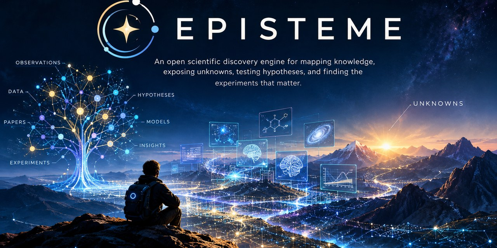

# Episteme

> An open scientific discovery engine for mapping knowledge, exposing unknowns, testing hypotheses, and finding the experiments that matter.

## What Is Episteme?

Episteme is an open project exploring whether a machine can help humanity discover things we do not yet know.

It is designed to keep several things separate that are too often blended together:

- evidence
- observations
- claims
- models
- hypotheses
- predictions
- contradictions
- unknowns
- experiments
- results

The goal is not to make a machine that sounds certain.

The goal is to build an instrument that can show **why we believe something, where the gaps are, what competing explanations remain possible, and what evidence would help distinguish them.**

## Looking for Scientific Testers

Episteme is ready for **external exploratory testing**.

If you are a scientist, researcher, engineer, mathematician, student, or simply someone who enjoys asking difficult questions, we'd like you to try it.

You do **not** need to be an Episteme expert, and you do not need to know how to program.

We're especially interested in what happens when someone tries to use Episteme for a real problem:

- What makes sense immediately?
- What is confusing?
- What information do you expect to be able to inspect but cannot?
- Does the provenance and reasoning trail make sense?
- Where does the system get in your way?
- What does it fail to represent?
- What unexpected behavior do you find?

**You do not need to know how to fix anything.**

If you find a software bug, please open a GitHub Issue.

If you have a scientific, conceptual, or workflow question or observation, please start a GitHub Discussion.

Tell us what you tried, what you expected, and what happened.

A failed attempt is useful information too.

Episteme is being developed as an instrument for inquiry. We want real use to show us where the instrument's actual boundaries are.

## The Core Idea

Episteme follows a closed discovery loop:

**evidence → knowledge → gaps → hypotheses → predictions → experiments → results → new knowledge**

The loop matters because discovery should not stop at generating plausible ideas.

A useful discovery system must eventually be able to ask:

> **What could we observe next that would actually tell us something?**

## Principles

The project is governed by [CANON.md](CANON.md).

The central architectural invariant is:

> **No information may gain epistemic authority merely by passing through Episteme.**

That means an AI-generated hypothesis remains a hypothesis until independently supported. A failed experiment remains a result. A contradiction remains visible. An unknown remains an unknown.

## Architecture

See [ARCHITECTURE.md](ARCHITECTURE.md) for the canonical system design.

The architecture separates:

- the **grounded world** — externally sourced observations, measurements, datasets, experiments, and results;
- the **interpretive world** — claims, models, hypotheses, predictions, analogies, and inferences;
- the **unknown world** — unresolved, unmeasured, contradictory, insufficiently evidenced, and unexplored states.

Phase 1 has a small executable grounded knowledge substrate with deterministic serialization, structural provenance checks, first-class relationships, and SQLite persistence.

## Roadmap

See [ROADMAP.md](ROADMAP.md).

Development begins with the smallest trustworthy knowledge substrate rather than with a large autonomous reasoning system.

## Documentation

Documentation follows the project's [Documentation Standard](DOCUMENTATION_STYLE.md).

The first documents to read are:

1. [Canon](CANON.md)
2. [Architecture](ARCHITECTURE.md)
3. [Roadmap](ROADMAP.md)
4. [Contributing](CONTRIBUTING.md)

## Project Status

Phase 1 grounded substrate, Phase 2 knowledge integrity, and Phase 3 discovery are complete and verified. Phase 4 hypothesis and prediction, Phase 5 experiment design, and Phase 6 closed-loop discovery are also complete and verified.

Phase 7 is complete and verified. The first two domain demonstrations are Astronomy and Biology, showing that materially different evidence shapes can use domain-specific layers while preserving Episteme's stable epistemic primitives, provenance, generated-versus-grounded boundaries, closed-loop lineage, and reproducibility.

Phase 8 established the public scientific instrument and is complete. Phase 9 established structural-gap discovery and is complete. Phase 10 established candidate completion downstream of those gaps and is complete. Phase 11 established the grounded evidence ingestion boundary and is complete. Phase 12 is complete. Phase 13 established durable execution history and is complete. Phase 14 exposed that durable execution history through the existing read-only public instrument and is complete. Phase 15 established reverse artifact-to-execution lineage and is complete. Phase 16 exposed the existing first-class relationship edges through the read-only public instrument and is complete. Phase 17 exposed the existing generated epistemic artifacts through the same read-only public instrument and is complete. Phase 18 exposed the existing generated discovery findings through that same instrument and is complete. Phase 19 established the external acquisition/captured-representation boundary, separating SQLite capture metadata from immutable filesystem-backed content, and is complete. Phase 20 established bounded provider-neutral external acquisition and its handoff into Phase 19 capture, and is complete. Phase 21 exposed persisted acquisition/capture state through the read-only public instrument, and is complete. Phase 22 links grounded records produced from captures to the exact capture event through existing provenance, and is complete. Phase 23 exposes the exact immutable captured representation through the read-only public Python, CLI, and HTTP surfaces with explicit capture-root configuration, and is complete. Phase 24 integrates bounded acquisition with finite workflow execution, and is complete. Phase 25 exposes reverse capture-to-execution lineage through the read-only public Python, CLI, and HTTP surfaces, and is complete. Phase 26 establishes the explicit Praxis evidence interoperability boundary, and is complete. Phase 27 establishes the bounded planner-driven autonomous discovery boundary, including host-owned exploration, structural-gap discovery, hypothesis/prediction/experiment progression, bounded experiment execution, and real-model acceptance, and is complete.

The canonical Phase 26 design is documented in docs/PRAXIS_HANDOFF.md. The canonical Phase 27 control boundary is documented in AUTONOMOUS_DISCOVERY.md, with the structural-discovery extension documented in docs/autonomous-structural-discovery.md.

## Project Boundary

Episteme is an independent project.

Existing system infrastructure may provide integration reference material, but unrelated repositories are outside Episteme's working scope.

Historical experiments and abandoned implementations are treated as archaeology, not inherited architecture.

## Author

**James Earl Stambaugh III**  
GitHub: [@mythologyprospector-hub](https://github.com/mythologyprospector-hub)  
Email: mythologyprospector@gmail.com

## License

License selection is intentionally not fixed yet.
